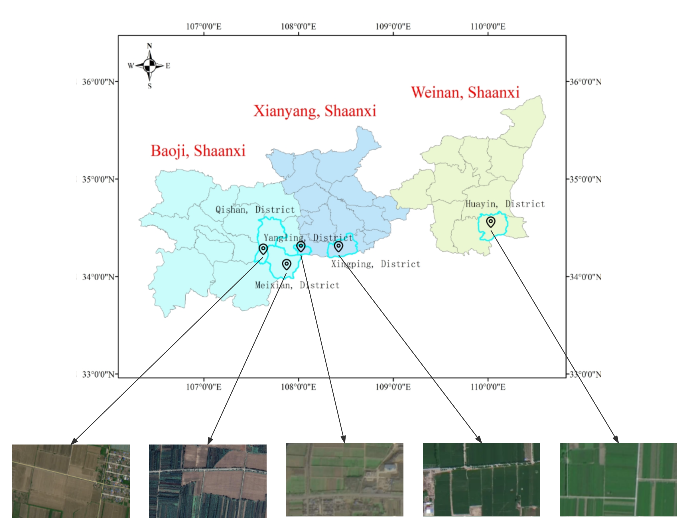
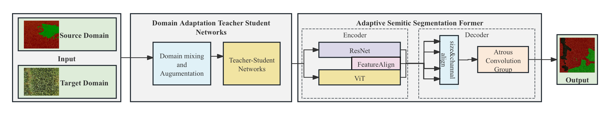
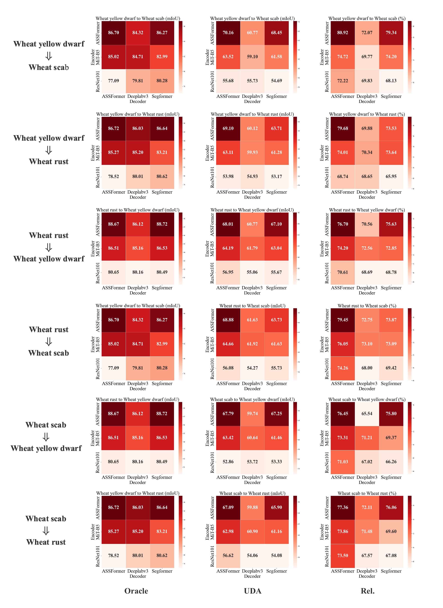
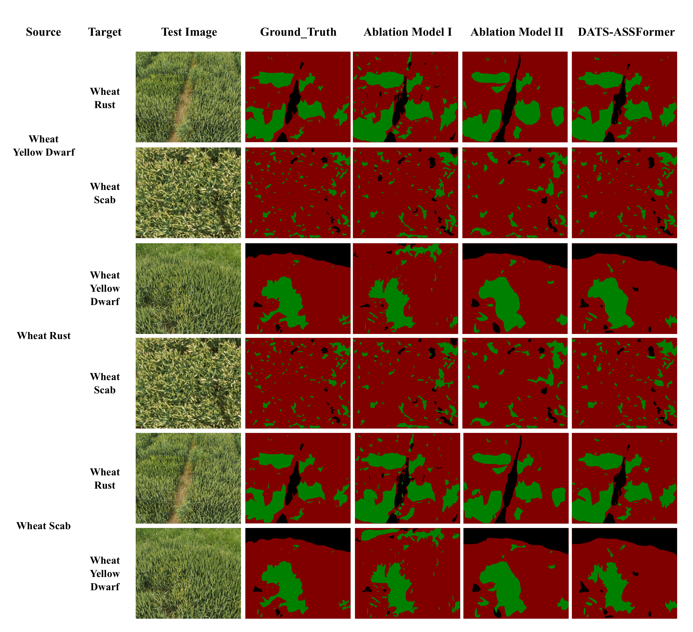

# DATS-ASSFormer: Domain Adaptation Teacher Student Adaptively semantic segmentation Transformer



## If you find this work useful for your research, please kindly star our repo and cite our paper.

## SET UP

### Clone this repo:

```shell script
git clone git@github.com:YcZhangSing/DATS-ASSFormer.git
cd DATS-ASSFormer
```

### Environment

See [requirements.txt](./requirements.txt), tested on Linux platforms. 

```shell scripts
conda create -n DATS-ASSFormer
conda activate DATS-ASSFormer
pip install -r requirements.txt -f https://download.pytorch.org/whl/torch_stable.html
pip install mmcv-full==1.3.7  # requires the other packages to be installed first
```


## DATASET


We establishment of the Northwest A&F University-Wheat Disease Remote Sensing Dataset (NWAFU-WDRSD): The publicly available dataset servers for UAV remote sensing of wheat diseases and comprises 1,438 sets containing 8,628 multispectral images of disease-affected wheat, including wheat rust, wheat yellow dwarf, and wheat scab. It supports high-quality pixel-level annotations for supervised and UDA performance comparisons.

The public release of NWAFU-WDRSD is imminent.

## Train&Test

- Train

  Run the following command: 

  ```shell script    
  python run_experiments.py --config configs/uda_warm_fdthings_rcs_croppl_a999_daformer_mitb5_s0.py
  ```

  The results are stored in `results_[INFERENCE_DATE]` folder.

- Test

  Pre-trained Weights:

  This project need MiT B series models,you can refer to [SegFormer repository](https://github.com/NVlabs/SegFormer)

  Or  you can also get them by this shell scripts [download_checkpoints.sh](tools/download_checkpoints.sh)

  For pre-trained models, please [send a request email](zycddl@gmail.com) with subject "APPLY FOR MODELS OF DATS-ASSFORMER" to us and describe **in detail** your purpose of using the models. Please inform us your name and institution, and use an email address **certified** by your research institution (e.g., @ia.ac.cn) to send this request, as we need to confirm that our models will not be used for any potential commercial purposes. Thanks for understanding! 

  Run Test with trained weights following command:

  ```shell script 
  sh test.sh path/to/checkpoint_directory
  ```

  


## Results




